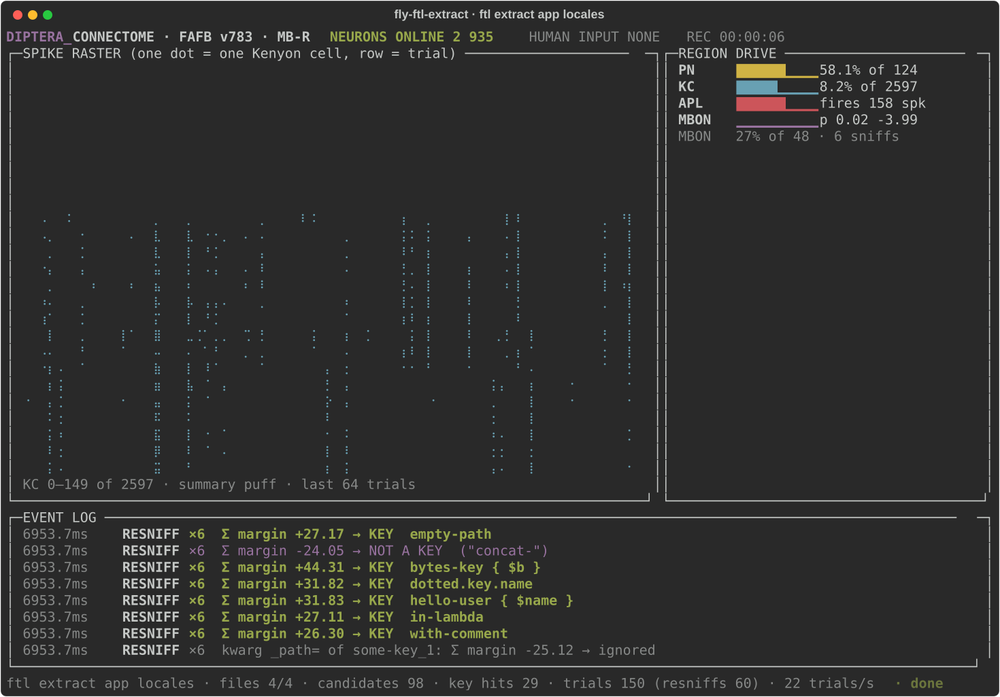

# fly-ftl-extract

Drop-in replacement for [`ftl-extract`](https://github.com/andrew000/FTL-Extract) 0.12.1 — the
same `ftl extract <code> <locales>`, with the same options and byte-for-byte the same output —
in which the decision «is this a Fluent key» is made not by a parser but by a simulated
fruit-fly mushroom body: LIF neurons on the real FlyWire FAFB v783 connectome (124 projection
neurons → 2597 Kenyon cells ⇄ 1 APL → 48 MBONs), a readout on the MBONs trained with
«dopamine» (delta rule). The tokenizer only proposes candidates (string literals and
attribute chains before `(`) and encodes their context into an odour; which of them is a key,
and which kwarg is placeable, the fly says.
**Switch the fly off and no keys are found:** the hot path has neither `ast` nor rules about
`i18n.get`; the test `tests/test_no_ast_in_hot_path.py` checks that a plain `ftl extract`
loads neither the AST reference nor the audit.

## How it works

```
Python file ──tokenize──▶ candidate + window (6 tokens before · focus · 3 after)
                                   │
                                   ▼  feature hashing → 14 puffs × 124 PN (rate coding, tanh)
        ┌─────────────────────────────────────────────────────────────────────┐
        │   PN 124  ──ACh──▶  KC 2597  ──ACh──▶  MBON 48       mushroom body  │
        │  Poisson,          LIF, τm 20 ms,        LIF          of FlyWire    │
        │  ≤ 200 Hz         V_th −45 mV               ▲         FAFB v783,    │
        │                    │       ▲                │   right hemisphere    │
        │                    ▼       │ GABA ×0.5      │         syn_count ≥ 5 │
        │                   APL 1 ───┘                │                       │
        │               (feedback inhibition,         │                       │
        │             8–10 % of KCs active per puff)  │                       │
        │                                             │                       │
        │   DAN 165 — teaching signal only ──────┘      (current = 0 in the sim)│
        └─────────────────────────────────────────────────────────────────────┘
                                   │  KC spike counts per puff (14 × 2597)
                                   ▼
        readout  w · [KC spiked, log1p(spikes)] + b  →  margin
        |margin| < θ  →  «sniff again» (up to 5 extra trials with other seeds), vote = Σ margin
        margin > 0  →  key  /  kwarg placeable
```

- **Temporal coding.** The window = 14 puffs of 40 ms with no silence between them + 10 ms of
  silence (570 ms, 5700 steps of 0.1 ms): 6 puffs of context before the candidate, 5 puffs of
  focus (`[root][attr1][attr2][attr3][summary]` for a chain, `[<STR>][silence×3][summary]` for
  a string), 3 puffs after. The membrane is not reset between puffs — that is the memory of
  the preceding tokens. Every puff is a 124-PN vector: hashed slot features (normalised token,
  token + distance, type, bracket depth, bigram), 2 buckets per feature, ≈ 10 active PNs per
  puff.
- **Normalisation, not rules.** `--i18n-keys`, `-p`, `--ignore-attributes`, `--ignore-kwargs`
  affect only the tokens (`i18n` → `<I18N>`, `self` → `<PREFIX>`, `set_locale` → `<IGNORE>`,
  `when` → `<IGNORE_KW>`), so `-k LF` smells the same as `i18n`. The decision is the sign of
  the margin.
- **Resniff.** θ is chosen on val so that ≤ 10 % of windows get extra sniffs; trial seed =
  sha256(file bytes, candidate index, encoder version) — two runs give the same output.
- **In detail:** [CLAUDE.md](CLAUDE.md) (the contract), [docs/CONNECTOME.md](docs/CONNECTOME.md)
  (the subgraph), [docs/BENCH.md](docs/BENCH.md) (calibration, speed),
  [docs/ODOR.md](docs/ODOR.md) (the encoder), [docs/METRICS.md](docs/METRICS.md) (training),
  [docs/FORMAT.md](docs/FORMAT.md) (what exactly the original does and what is reproduced).

## Installation

**Python 3.14** is required (`requires-python = ">=3.14,<3.15"`). The package is not on PyPI;
it is installed from a local checkout or from the wheel (`uv build` → `dist/`):

```bash
uv tool install --python 3.14 /path/to/checkout/fly_ftl_extract                        # from a checkout, or
uv tool install --python 3.14 ./dist/fly_ftl_extract-0.1.0-py3-none-any.whl
pip install ./dist/fly_ftl_extract-0.1.0-py3-none-any.whl                            # in a 3.14 venv
```

The wheel contains the connectome (`fly_ftl_extract/data/mb_fafb783.npz`, 106 KB), its
metadata (`meta.json`) and the trained weights (`mbon_weights.npz`, 595 KB); runtime
dependencies — `numpy`, `scipy`, `rich`, `click`, `fluent.syntax`.

**Entry-point conflict.** The package installs the scripts `ftl` and `fly-ftl`. The original
`ftl-extract` also installs `ftl`; in one environment the last one installed wins, so do not
put both into one venv — keep them in separate `uv tool` environments or call ours as
`fly-ftl`.

## Usage

Everything as in the original 0.12.1 (the FTL-Extract README): `ftl extract CODE_PATH
LOCALES_PATH`, `-l/--language`, `-k/--i18n-keys`, `-K`, `-p/--i18n-keys-prefix`, `-e/-E`,
`-i/-I`, `--ignore-kwargs`, `--default-ftl-file`, `--comment-keys-mode {comment,warn}`,
`--line-endings`, `--dry-run`, `--cache`/`--cache-path`/`--clear-cache`,
`--allow-parse-errors`, `-v`, the global `--config`, the `[tool.ftl-extract.extract]` section
in `pyproject.toml` (CLI > pyproject > defaults), `ftl config sample`. Output, exit codes and
the `.ftl` tree — as with the Rust binary; after its `✅ Done` the block `[INFO  fly] Fly
statistics:` is printed (neurons, files, candidates, trials, resniffs, trials/s, brain time).

```bash
ftl extract app/bot app/bot/locales -l en -l uk          # drop-in
ftl extract app locales --fly-audit                       # run the AST reference alongside, differences → stderr, exit 1
ftl extract app locales -v --fly-no-tui                   # the margin of every window after ✅ Done
```

Our options (all prefixed `--fly-`):

| option | what it does |
|---|---|
| `--fly-audit` | the AST reference (`fly_ftl_extract.reference`) runs alongside; every difference is a `[WARN  fly::audit] …` line, exit 1 |
| `--fly-no-tui` | a plain log even in a terminal (without a tty the TUI switches itself off) |
| `--fly-workers N` | processes for the brain (spawn; default CPU−2, ≤ 16); below 128 windows always a single process |
| `--fly-batch N` | trials per brain call (256 in a single process, 64 in a worker, 16 under the TUI) |
| `--fly-trials N` | base trials per window before the resniff rule (the margins are summed) |
| `--fly-seed S` | a salt on every trial seed — «another nose»; 0 = the production seeds |

### TUI

In a terminal `ftl extract` draws a live panel (`rich`, ≤ 15 fps): a spike raster of the
Kenyon cells (one dot = one cell that spiked in the trial's summary puff, one row = one
trial), the PN/KC/APL/MBON activity of the last trial, an event log (ODOR → MBON margin →
KEY / NOT A KEY / placeable, RESNIFF) and counters. All numbers are real — from the
connectome, the spikes and the readout; the module has no `random`.



## Accuracy

Dataset `grammar-4`: 20 000 synthetic snippets labelled by the AST reference (376 336
candidates, 113 688 kwargs; split 80/10/10 by snippet). The golden fixtures from `tests/` are
not part of the dataset.

| what | result | source |
|---|---|---|
| keys, test, with resniff (≤ 5 extra trials, 9.8 % of windows) | **P 0.9991 · R 0.9999** (tp 9531, fp 9, fn 1, tn 28251) | [METRICS.md §1](docs/METRICS.md) |
| keys, test, without resniff | P 0.9963 · R 0.9970 | same |
| kwargs (placeable / ignore), test | P 1.0000 · R 1.0000 | same |
| golden fixtures through the whole fly | 24 / 24 files match the reference | `tests/test_judge_on_fixtures.py` |
| the real `ftl 0.12.1` against ours on every fixture | **31 / 31** runs byte for byte (exit, stderr, tree), `config sample` too | [COMPARE.md](docs/COMPARE.md) |
| a real aiogram bot (291 files, 10 163 candidates, 502 keys) | 15 differences: 1 false key, 8 missed, 5 shifted positions, +1 in the file counter | [REAL_PROJECT.md](docs/REAL_PROJECT.md), the «Limitations» section |

## Limitations

- One hemisphere (right: 2597 KCs vs 2580 in the left); the left one is not used.
- 15 GABAergic iPNs per side are excluded from the PNs (three have ≥ 5 synapses onto KCs and would break the rule «PN→KC only positive»).
- `syn_scale = 5.0` and `apl_scale = 0.5` are calibrated on our odours (8–10 % KCs per puff, APL inhibits ≥ 2×), not taken from Shiu et al.; the APL weight is scaled separately.
- A 40 ms puff, not 20 (the reviewer asked for 20; at 20 the per-puff KC code was not reproducible — Jaccard 0.34).
- Synapse threshold `syn_count ≥ 5` per neuron pair; DANs carry no current in the forward simulation.
- Speed ≈ 50 trials/s per process (one trial = 5700 LIF steps), ≈ 400 trials/s on 16 processes; a bot with 10 163 candidates takes 24 s against 0.03 s for the Rust original.
- `ftl stub` and `ftl check` are not implemented (a message and exit 2).
- The `--cache` cache is written to the same file as in the original, but the format is ours and not compatible with the original.
- `-v` does not reproduce the original's debug lines (`globset`, `Saved …`); our margins come instead.
- `i18n.get("dotted.key.name")` and other invalid Fluent identifiers are written as is — the original does the same (the next run of either will fail reading the `.ftl`).
- The fly makes mistakes. On the test split (with resniff) 9 false keys among 28 260 negatives and 1 miss among 9 532 positives; the typical false key is `return self.get("ok.button")` with `-p self` (margin +8.96; for the reference `self.get` without an i18n name is not a key), the typical miss is `self.i18n.group_label()` right after a line with an assignment (margin −2.00). On the real bot every `L("…", _path=…)` in dict values and in dataclass constructor fields was missed (`name=L("resource-silver-name", …)` recognised, `description=L(…)` on the next line — margin −5.6…−31), `LF("…")` as the first argument of the decorator `@router.message(` (margin −18.7), and a string in a tuple `("captcha_timeout_task", …)` without a call was called a key (+7.00). These are contexts the dataset grammar does not have; they are not cured with rules in the code — only with the grammar and retraining.

## Citations and licences

- Connectome: **FlyWire** FAFB v783, Zenodo [10676866](https://zenodo.org/records/10676866), CC-BY 4.0.
  Dorkenwald S. et al. *Neuronal wiring diagram of an adult brain.* Nature 634, 124–138 (2024).
  Schlegel P. et al. *Whole-brain annotation and multi-connectome cell typing of Drosophila.* Nature 634, 139–152 (2024) — neuron annotations ([flyconnectome/flywire_annotations](https://github.com/flyconnectome/flywire_annotations)).
- Neuron model and parameters: Shiu P. K. et al. *A Drosophila computational brain model reveals sensorimotor processing.* Nature 634, 210–219 (2024) ([philshiu/Drosophila_brain_model](https://github.com/philshiu/Drosophila_brain_model)).
- Inspiration (the mushroom body as a hash function): Dasgupta S., Stevens C. F., Navlakha S. *A neural algorithm for a fundamental computing problem.* Science 358, 793–796 (2017).
- Fluent: [python-fluent](https://github.com/projectfluent/python-fluent) (`fluent.syntax`, Apache 2.0) — parser and serializer, byte-for-byte compatible with fluent-rs on every golden file.
- The original: [FTL-Extract](https://github.com/andrew000/FTL-Extract) © andrew000, MIT. The output format, key order (`FxHashMap`), file walk and message texts are reproduced from the behaviour of the 0.12.1 binary.
- This package is MIT. The data `fly_ftl_extract/data/mb_fafb783.npz` is a derivative work of FlyWire (CC-BY 4.0).

## How to reproduce

Everything is deterministic (the seeds are fixed); the times are from this machine (16 processes for the brain).

| step | command | what it does | time |
|---|---|---|---|
| 1 | download `proofread_connections_783.feather` (852 MB), `proofread_root_ids_783.npy`, `Supplemental_file1_neuron_annotations.tsv` into `.cache/flywire/` | raw FlyWire data | — |
| 2 | `uv run --extra connectome python scripts/build_connectome.py` | the mushroom-body subgraph → `data/mb_fafb783.npz` + `meta.json`, `docs/CONNECTOME.md` | ≈ 4 s (the feather is read through a memory map in batches, only the needed columns); a repeated run gives byte-for-byte the same npz, only the build date changes in `meta.json` |
| 3 | `uv run python scripts/make_dataset.py` | 20 000 snippets of the `grammar-4` grammar, labelling by the AST reference, encoding → `data/dataset/` | 10.7 s generation + 142 s labelling and encoding |
| 4 | `uv run python scripts/train.py` | the brain on every window (train × 6 seeds, val, test; state cache in `.cache/brain_states/`), delta rule, θ, fixtures → `data/mbon_weights.npz`, `docs/METRICS.md` | 7563 s in total in a run with the state cache: brain keys 748 s (without the cache — a full recompute ≈ 50 min, 16 processes), kwargs 1006 s, readout keys 5222 s (100 epochs), kwargs 135 s, fixtures 32 s |
| 5 | `uv run pytest -q` | 295 tests (294 passed + 1 diagnostic xfail), among them golden through the fly and `--fly-audit` on the fixtures | ≈ 2.5 min |
| 6 | `uv run python scripts/compare_with_reference.py` | the real `ftl 0.12.1` (via `uv tool run`) against ours → `docs/COMPARE.md` | ≈ 45 s |
